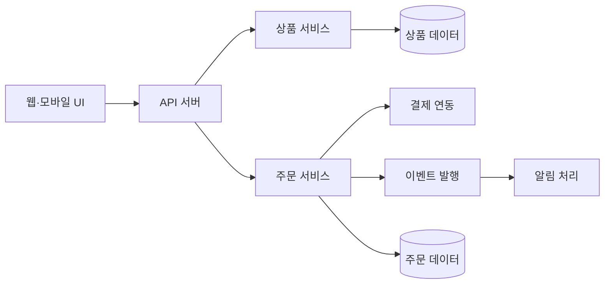
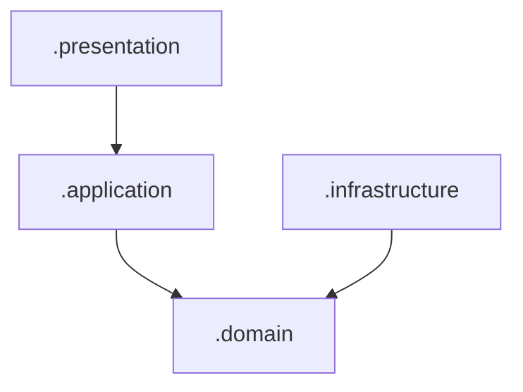
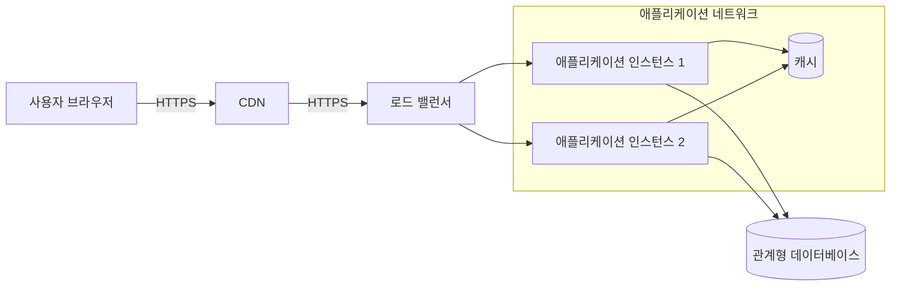

# 시스템 설계와 소프트웨어 아키텍처

## 학습 목표

- 시스템 설계의 과정과 주요 원리를 설명할 수 있다.
- 요구사항과 품질 속성을 근거로 설계 결정을 내릴 수 있다.
- 아키텍처 모델을 이용해 시스템을 여러 관점으로 표현할 수 있다.
- 패키지 다이어그램과 배치 다이어그램을 읽고 작성할 수 있다.
- 대표적인 아키텍처 패턴의 장단점을 비교할 수 있다.

## 1. 시스템 설계란 무엇인가

시스템 설계는 요구사항을 구현 가능한 구조로 구체화하는 활동이다. 시스템을 구성 요소로 분해하고, 각 요소의 책임과 인터페이스, 데이터 흐름과 실행 환경을 결정한다.

```text
요구사항
  -> 설계 목표와 제약 확인
  -> 시스템 분해
  -> 구성 요소와 인터페이스 결정
  -> 대안 비교
  -> 아키텍처 모델 작성
  -> 검토와 검증
```

기술을 선택하는 것만으로는 설계가 완성되지 않는다. 왜 그 기술과 구조를 선택했는지, 어떤 장점과 단점을 받아들였는지 설명할 수 있어야 한다.

## 2. 시스템과 소프트웨어 아키텍처

시스템은 소프트웨어, 하드웨어, 데이터, 네트워크, 사용자와 운영 절차가 함께 목표를 수행하는 전체이다.

소프트웨어 아키텍처는 다음 내용을 다룬다.

- 주요 구성 요소와 책임
- 구성 요소 사이의 관계와 인터페이스
- 데이터와 제어의 흐름
- 배포 위치와 실행 환경
- 품질 속성에 영향을 주는 중요한 결정
- 구조를 변경할 때 지켜야 하는 제약

아키텍처는 모든 클래스와 함수를 자세히 표현하지 않는다. 시스템의 품질과 변경 비용에 큰 영향을 주는 구조를 중심으로 표현한다.

## 3. 설계 과정

### 설계 입력 확인

기능 요구사항, 비기능 요구사항, 제약사항과 도메인 모델을 확인한다. 특히 성능, 보안, 가용성과 변경 용이성처럼 구조에 큰 영향을 주는 요구사항을 아키텍처 중요 요구사항이라고 한다.

### 설계 목표와 우선순위 설정

모든 품질 속성을 동시에 최고 수준으로 만들 수는 없다. 무엇을 우선하고 어떤 수준의 단점을 받아들일지 결정한다.

| 품질 속성 | 설계 질문 |
| --- | --- |
| 성능 | 어느 시간 안에 얼마나 많은 요청을 처리해야 하는가 |
| 가용성 | 일부 구성 요소가 실패해도 서비스를 계속 제공해야 하는가 |
| 보안 | 어떤 자원에 누가 접근할 수 있는가 |
| 확장성 | 사용자와 데이터가 늘면 어느 부분을 확장해야 하는가 |
| 변경 용이성 | 자주 바뀌는 기능을 다른 기능과 분리했는가 |
| 관찰 가능성 | 상태와 오류 원인을 어떻게 확인하는가 |

### 시스템 분해

큰 책임을 작은 구성 요소로 나눈다. 분해 기준은 기능, 업무 영역, 계층, 데이터와 배포 단위가 될 수 있다.

### 인터페이스 정의

구성 요소가 어떤 요청과 데이터를 주고받는지 정한다. HTTP API, 함수 호출, 데이터베이스, 메시지 큐가 인터페이스가 될 수 있다.

### 설계 대안 비교

하나의 대안을 바로 선택하지 않고 품질 목표, 구현 비용과 운영 복잡성을 기준으로 비교한다.

### 모델과 문서 작성

구성 요소, 데이터 흐름, 배치 구조와 주요 결정을 필요한 관점으로 기록한다.

### 설계 검증

정상 흐름뿐 아니라 장애, 부하 증가, 보안 사고와 변경 시나리오를 이용해 구조를 검토한다.

## 4. 설계 원리

### 관심사의 분리

서로 다른 문제를 담당하는 부분을 분리한다. 화면 표현, 업무 규칙과 데이터 저장을 구분하면 각 부분의 변경 영향을 줄일 수 있다.

### 높은 응집도

하나의 구성 요소에는 같은 목적을 가진 기능을 모은다. 관련 없는 책임이 섞이면 수정할 이유가 많아진다.

### 낮은 결합도

구성 요소가 다른 요소의 내부 구현에 지나치게 의존하지 않도록 한다. 공개된 인터페이스에 의존하면 내부 구현을 바꾸기 쉬워진다.

### 정보 은닉

외부에서 알 필요가 없는 구현 세부사항을 감춘다. 데이터 구조와 처리 방법을 직접 노출하면 변경 시 외부 사용자까지 영향을 받는다.

### 단일 책임

구성 요소가 변경되는 핵심 이유를 하나로 유지한다. 하나의 구성 요소가 인증, 결제와 알림을 모두 처리하면 어느 기능을 바꿔도 같은 부분을 수정하게 된다.

### 의존성 역전

핵심 업무 규칙이 데이터베이스나 외부 API의 구체 구현에 직접 의존하지 않도록 추상화된 계약에 의존한다.

### 최소 권한

사용자와 구성 요소에 필요한 권한만 부여한다. 잘못된 동작이나 침해가 발생했을 때 피해 범위를 줄일 수 있다.

### 단순성

현재 요구사항과 확인된 변화 가능성을 해결하는 가장 단순한 구조를 선택한다. 필요성이 불분명한 계층과 서비스를 미리 추가하지 않는다.

## 5. 설계 결정

설계 결정은 여러 선택지 중 하나를 고르는 활동이다. 결정에는 근거와 결과가 따라야 한다.

### 설계 결정 예시

```text
문제
  주문 완료 후 이메일과 문자 알림을 보내야 한다.

대안 A
  주문 요청 안에서 알림을 즉시 전송한다.

대안 B
  주문 완료 이벤트를 발행하고 별도 작업자가 알림을 전송한다.

결정 기준
  주문 응답 시간, 알림 실패가 주문에 미치는 영향, 운영 복잡성

선택
  대안 B를 선택한다.

결과
  주문과 알림의 결합은 줄어들지만 메시지 큐와 재처리 관리가 필요하다.
```

### 트레이드오프

한 품질을 높이는 결정이 다른 비용을 증가시키는 관계를 트레이드오프라고 한다.

- 캐시는 응답 속도를 높이지만 데이터 일관성 관리가 필요하다.
- 서비스를 분리하면 독립 배포가 가능하지만 네트워크와 운영 복잡성이 늘어난다.
- 데이터를 여러 서버에 복제하면 가용성이 높아지지만 동기화 문제가 생긴다.

좋은 결정은 단점이 없는 결정이 아니라 목표에 맞는 단점을 의식적으로 선택한 결정이다.

## 6. 아키텍처 결정 기록

ADR(Architecture Decision Record)은 중요한 설계 결정과 이유를 짧게 남기는 문서이다.

```text
제목: ADR-004 주문 알림을 비동기로 처리

상태: 채택

상황:
외부 알림 서비스의 응답 지연과 실패가 주문 완료 응답을 늦추고 있다.

결정:
주문 완료 후 메시지 큐에 이벤트를 발행하고 알림 작업자가 처리한다.

대안:
- 주문 요청에서 동기 처리
- 일정 시간마다 미전송 알림 일괄 처리

결과:
- 주문과 알림의 장애를 분리할 수 있다.
- 메시지 중복과 재처리를 관리해야 한다.
```

ADR은 결정 당시의 상황과 받아들인 단점을 알려 준다. 상황이 바뀌면 기존 결정을 유지할지 다시 판단할 근거가 된다.

## 7. 아키텍처 모델과 관점

하나의 그림으로 시스템의 모든 정보를 표현하면 복잡해진다. 목적에 따라 서로 다른 관점으로 나누어 표현한다.

| 관점 | 주요 질문 |
| --- | --- |
| 기능 관점 | 어떤 구성 요소가 어떤 책임을 가지는가 |
| 개발 관점 | 소스 코드와 패키지가 어떻게 나뉘는가 |
| 프로세스 관점 | 실행 중인 프로세스가 어떻게 통신하는가 |
| 배치 관점 | 어느 서버와 네트워크에서 실행되는가 |
| 데이터 관점 | 데이터가 어디에 저장되고 어떻게 이동하는가 |

모델은 실제 시스템의 일부 특징을 목적에 맞게 단순화한 표현이다. 그림에 없는 요소가 존재하지 않는다는 의미는 아니다.

## 8. 구성 요소 모델

다음은 온라인 주문 시스템의 주요 책임을 표현한 논리 구성도이다.



구성 요소 모델에서는 각 요소의 책임과 의존 방향이 명확해야 한다. 단순히 사용한 기술 목록을 나열하는 그림이 되어서는 안 된다.

## 9. 인터페이스 설계

인터페이스는 구성 요소 사이의 계약이다. 계약에는 다음 내용이 포함된다.

- 요청을 보내는 주체와 받는 주체
- 프로토콜과 주소
- 입력 데이터와 형식
- 성공과 실패 응답
- 시간 제한과 재시도 정책
- 인증과 권한
- 버전 변경 규칙

### API 계약 예시

```text
기능: 주문 생성
메서드와 경로: POST /orders
입력: 사용자 ID, 주문 항목, 배송지
성공: HTTP 201, 주문 ID와 현재 상태
실패: HTTP 400 입력 오류, HTTP 409 재고 부족
보안: 로그인한 사용자만 호출 가능
중복 처리: 같은 요청 키는 하나의 주문만 생성
```

내부 구현이 바뀌더라도 외부에 약속한 인터페이스를 유지하면 변경 영향을 줄일 수 있다.

## 10. 패키지 다이어그램

패키지 다이어그램은 코드의 큰 묶음과 의존 관계를 표현한다.



이 예에서 업무 규칙을 가진 `domain` 패키지는 화면과 데이터베이스 구현을 직접 알지 않는다. 외부 구현은 도메인이 정의한 계약을 사용한다.

패키지를 나눌 때 확인할 질문은 다음과 같다.

- 같은 이유로 변경되는 코드가 함께 있는가
- 패키지의 책임을 한 문장으로 설명할 수 있는가
- 의존 관계가 순환하지 않는가
- 내부 구현이 불필요하게 외부에 노출되지 않는가
- 단순한 기능에 과도한 계층을 만들지 않았는가

## 11. 배치 다이어그램

배치 다이어그램은 소프트웨어가 실제 실행되는 노드와 통신 관계를 표현한다.



배치 다이어그램에는 필요에 따라 다음 정보를 표시한다.

- 서버, 컨테이너와 실행 프로세스
- 네트워크 구역과 외부 연결
- 통신 프로토콜과 포트
- 데이터베이스와 저장소
- 이중화와 확장 단위
- 보안 경계

논리 구성도와 배치 다이어그램은 같은 시스템을 다른 관점으로 표현한다. 논리 구성도는 책임을, 배치 다이어그램은 실행 위치를 중심으로 본다.

## 12. 아키텍처 패턴

아키텍처 패턴은 시스템 수준에서 반복되는 구조적 문제에 대한 일반적인 해결 방법이다.

### 계층형 아키텍처

표현, 업무 로직과 데이터 접근처럼 책임을 계층으로 나눈다.

```text
표현 계층 -> 응용 계층 -> 도메인 계층 -> 데이터 접근 계층
```

장점은 구조와 책임을 이해하기 쉽다는 점이다. 단점은 단순한 요청도 여러 계층을 통과하고, 계층 사이의 경계가 형식적으로만 남을 수 있다는 점이다.

### 클라이언트-서버

클라이언트가 요청하고 서버가 기능과 데이터를 제공한다. 웹과 모바일 애플리케이션에서 널리 사용한다. 서버 장애, 네트워크 지연과 동시 접속을 고려해야 한다.

### MVC

Model, View, Controller로 책임을 나눈다.

- Model은 데이터와 업무 규칙을 담당한다.
- View는 사용자에게 결과를 표현한다.
- Controller는 입력을 받아 적절한 동작을 연결한다.

프레임워크마다 세 요소의 구체적인 역할과 이름은 다를 수 있다.

### 이벤트 기반 아키텍처

구성 요소가 이벤트를 발행하고 다른 구성 요소가 비동기로 처리한다. 결합도를 낮추고 처리량을 조절하기 좋지만 실행 순서, 중복 처리와 오류 추적이 복잡해진다.

### 파이프와 필터

데이터가 독립적인 처리 단계를 순서대로 통과한다. 데이터 변환, 컴파일과 배포 파이프라인에 적합하다. 각 단계의 입력과 출력 형식이 명확해야 한다.

### 마이크로서비스

업무 영역을 독립적으로 배포 가능한 서비스로 나눈다. 서비스별 확장과 독립 배포가 가능하지만 네트워크, 데이터 일관성, 모니터링과 배포 운영이 복잡해진다.

서비스 수가 적거나 조직이 작은 경우에는 잘 나눈 모듈형 단일 애플리케이션이 더 단순할 수 있다.

## 13. 아키텍처 문서화

아키텍처 문서는 그림만 모아 놓은 자료가 아니다. 구조의 목적과 결정 이유를 함께 전달해야 한다.

### 문서에 포함할 내용

- 시스템의 목적과 범위
- 주요 이해관계자와 품질 목표
- 시스템 컨텍스트와 외부 연동
- 주요 구성 요소와 책임
- 패키지와 의존 관계
- 배치 환경과 네트워크
- 데이터 저장과 흐름
- 주요 설계 결정과 ADR
- 알려진 제약과 위험

### 좋은 다이어그램의 조건

- 그림의 목적과 범위를 제목으로 표시한다.
- 요소의 이름과 책임을 일관되게 사용한다.
- 화살표의 방향과 의미를 설명한다.
- 기술 이름만 나열하지 않는다.
- 너무 많은 세부사항을 한 그림에 넣지 않는다.
- 실제 시스템이 바뀌면 문서도 함께 갱신한다.

## 14. 아키텍처 검증

품질 시나리오를 이용하면 설계가 요구사항을 만족하는지 구체적으로 검토할 수 있다.

```text
자극
  평소보다 열 배 많은 주문 요청이 들어온다.

환경
  정상 운영 중이다.

대상
  API 서버와 데이터베이스이다.

기대 반응
  API 서버를 수평 확장하고 요청을 분산한다.

측정 기준
  요청의 95%를 2초 안에 처리하고 오류율을 1% 미만으로 유지한다.
```

검토할 대표 시나리오는 다음과 같다.

- 서버 한 대가 중지된다.
- 데이터베이스 연결이 끊어진다.
- 외부 결제 서비스가 응답하지 않는다.
- 개인정보 조회 권한이 없는 요청이 들어온다.
- 사용자와 데이터가 열 배 증가한다.
- 새로운 결제 수단을 추가한다.

## 핵심 정리

- 시스템 설계는 요구사항을 구성 요소, 인터페이스와 실행 구조로 구체화한다.
- 설계 원리는 변경 영향을 줄이고 책임을 명확하게 만드는 기준이다.
- 중요한 결정은 대안, 근거와 트레이드오프를 함께 기록해야 한다.
- 아키텍처는 기능, 개발, 배치와 데이터 등 여러 관점으로 나누어 표현한다.
- 패턴은 상황에 맞게 선택하며 복잡성이라는 비용도 함께 평가한다.

## 확인 문제

1. 논리 구성도와 배치 다이어그램의 차이를 설명한다.
2. 높은 응집도와 낮은 결합도가 필요한 이유를 설명한다.
3. 이벤트 기반 아키텍처의 장점과 단점을 하나씩 작성한다.
4. ADR에 선택한 대안뿐 아니라 결과를 기록해야 하는 이유를 설명한다.

<details>
<summary>정답 예시</summary>

1. 논리 구성도는 소프트웨어 구성 요소의 책임과 관계를 표현하고, 배치 다이어그램은 소프트웨어가 실행되는 서버, 프로세스와 네트워크 위치를 표현한다.
2. 관련된 책임을 한곳에 모으고 다른 구성 요소의 내부 구현에 대한 의존을 줄이면 변경 범위가 작아지고 독립적으로 이해하고 테스트하기 쉬워진다.
3. 장점은 이벤트 발행자와 처리자를 느슨하게 연결할 수 있다는 점이다. 단점은 처리 순서, 중복, 재시도와 오류 추적이 복잡해진다는 점이다.
4. 선택으로 얻는 장점뿐 아니라 새로 생기는 제약과 비용을 알아야 상황이 바뀌었을 때 결정을 유지하거나 변경할 근거를 판단할 수 있기 때문이다.

</details>
