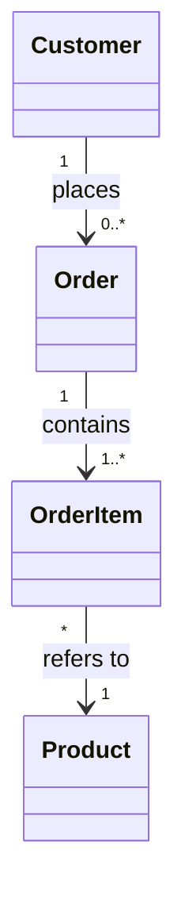
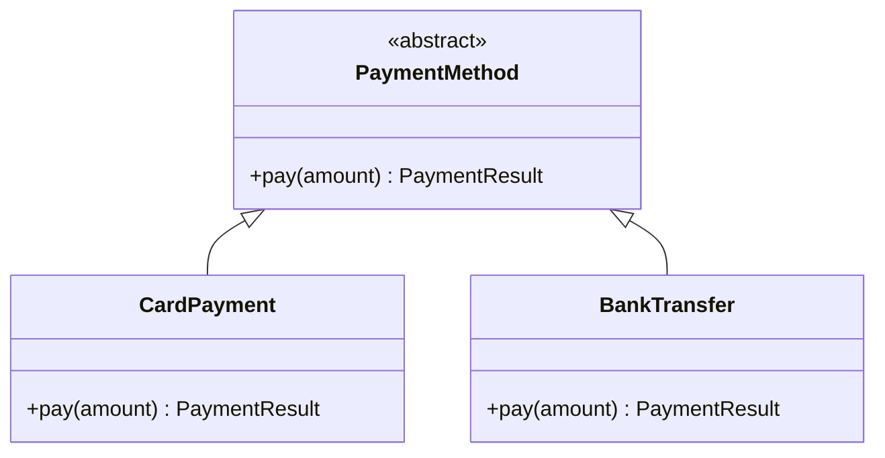
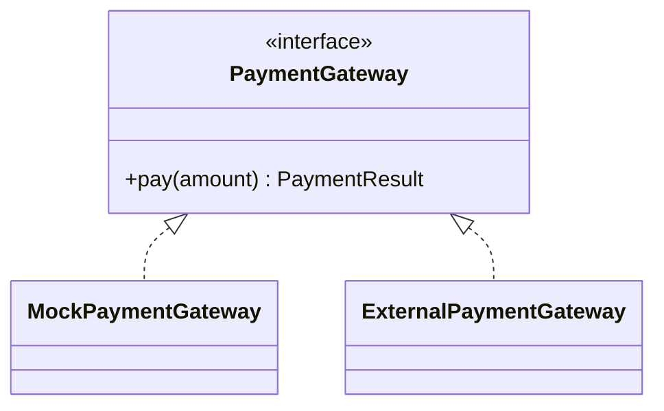
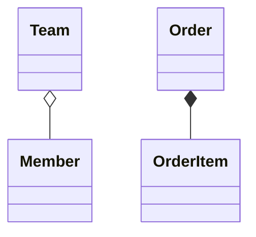
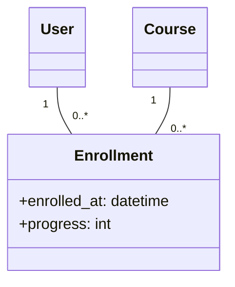
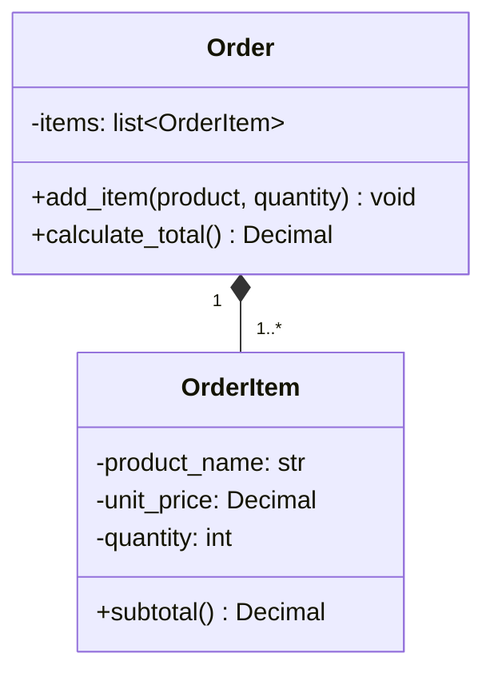

# 객체 설계와 클래스 다이어그램

## 학습 목표

- 객체, 클래스, 책임과 협력의 관계를 설명할 수 있다.
- 클래스 다이어그램의 속성, 메서드와 가시성을 읽을 수 있다.
- 연관 관계, 다중도, 일반화와 전체·부분 관계를 구분할 수 있다.
- 요구사항에서 클래스 후보를 찾고 클래스 다이어그램을 작성할 수 있다.
- 클래스 다이어그램을 객체지향 코드로 연결할 수 있다.

## 1. 객체 설계란 무엇인가

객체 설계는 시스템 내부의 책임을 객체 단위로 나누고 객체가 서로 협력하는 방법을 결정하는 활동이다.

다음 질문에 답하는 과정이라고 볼 수 있다.

- 시스템에는 어떤 개념이 존재하는가
- 각 객체는 어떤 상태와 행동을 가지는가
- 어떤 객체가 어떤 책임을 담당하는가
- 객체는 어떤 메시지를 주고받는가
- 객체 사이의 관계와 생명주기는 어떠한가
- 변경이 발생하면 어느 객체가 영향을 받는가

객체를 많이 만드는 것이 목적은 아니다. 요구사항을 이해하기 쉬운 책임으로 나누고 변경 영향을 통제하는 것이 목적이다.

## 2. 객체와 클래스

### 객체

객체는 상태와 행동을 가진 실행 시점의 대상이다.

```text
객체: 주문 2026-001
상태: 결제 완료, 총액 45,000원
행동: 취소한다, 배송을 시작한다
```

### 클래스

클래스는 같은 종류의 객체가 공통으로 가지는 상태와 행동을 정의한 틀이다.

```text
클래스: Order
속성: order_number, status, total_amount
행동: cancel(), start_shipping()
```

### 인스턴스

클래스를 이용해 실제로 생성한 객체를 인스턴스라고 한다. 하나의 `Order` 클래스로 서로 다른 상태를 가진 여러 주문 인스턴스를 만들 수 있다.

## 3. 상태, 행동과 책임

### 상태

객체가 현재 가지고 있는 값이다. 속성이나 필드로 표현한다.

### 행동

객체가 수행할 수 있는 동작이다. 메서드로 표현한다.

### 책임

객체가 알아야 하는 정보와 수행해야 하는 행동이다. 좋은 객체는 자신의 상태와 관련된 규칙을 스스로 지킨다.

```python
from decimal import Decimal


class Order:
    def __init__(self, total_amount: Decimal):
        self.total_amount = total_amount
        self.status = "created"

    def cancel(self):
        # 배송이 시작된 주문은 주문 객체가 직접 취소를 거부한다.
        if self.status == "shipping":
            raise ValueError("배송 중인 주문은 취소할 수 없다")
        self.status = "cancelled"
```

취소 가능 여부를 화면마다 따로 판단하면 규칙이 중복되고 서로 다른 결과가 생길 수 있다. 상태를 가진 객체가 규칙을 책임지면 일관성을 유지하기 쉽다.

## 4. 협력과 메시지

하나의 객체가 모든 일을 처리하지 않는다. 객체는 다른 객체에 필요한 작업을 요청하며 협력한다.

```text
OrderService
  -> Inventory에 재고 확인 요청
  -> PaymentGateway에 결제 요청
  -> OrderRepository에 주문 저장 요청
```

메시지는 객체에 무엇을 요청하는지를 표현한다. 호출하는 쪽은 상대 객체의 내부 처리 과정보다 공개된 인터페이스에 의존해야 한다.

## 5. 응집도와 결합도

### 응집도

한 클래스의 데이터와 행동이 하나의 목적에 얼마나 집중되어 있는지를 나타낸다. 주문 금액 계산과 사용자 비밀번호 검증이 같은 클래스에 있다면 서로 다른 책임이 섞여 응집도가 낮다.

### 결합도

한 클래스가 다른 클래스의 내부 구현을 얼마나 많이 알고 있는지를 나타낸다. 주문 서비스가 특정 결제 API의 요청 형식까지 직접 처리하면 외부 API가 바뀔 때 주문 로직도 수정해야 한다.

객체 설계는 일반적으로 높은 응집도와 낮은 결합도를 지향한다. 단, 책임을 지나치게 작게 나누면 클래스와 호출 관계가 불필요하게 늘어날 수 있다.

## 6. 클래스 다이어그램의 기초

클래스 다이어그램은 UML(Unified Modeling Language)을 이용해 클래스의 구조와 관계를 표현한다.

```text
+--------------------------------+
| Order                          |  클래스 이름
+--------------------------------+
| - order_number: str            |  속성
| - status: OrderStatus          |
| - total_amount: Decimal        |
+--------------------------------+
| + cancel(): void               |  메서드
| + calculate_total(): Decimal   |
+--------------------------------+
```

클래스 상자는 일반적으로 세 부분으로 구성된다.

1. 클래스 이름
2. 속성
3. 메서드

설계 목적에 따라 속성과 메서드의 세부사항을 생략할 수 있다. 도메인 개념을 설명하는 그림에 모든 자료형과 메서드를 넣으면 핵심 관계가 잘 보이지 않을 수 있다.

## 7. 속성과 메서드 표기

### 속성 표기

```text
가시성 속성이름: 자료형 = 기본값
```

```text
- status: OrderStatus = CREATED
- total_amount: Decimal
```

### 메서드 표기

```text
가시성 메서드이름(매개변수: 자료형): 반환자료형
```

```text
+ add_item(product: Product, quantity: int): void
+ calculate_total(): Decimal
```

밑줄은 클래스 자체에 속하는 정적 속성이나 메서드를, 기울임꼴은 추상 클래스나 추상 메서드를 표현하는 데 사용한다. 도구마다 표현 방식이 다를 수 있으므로 범례를 함께 제공한다.

## 8. 클래스와 가시성

가시성은 클래스의 속성과 메서드를 어느 범위에서 사용할 수 있는지를 나타낸다.

| 기호 | 의미 | 설명 |
| --- | --- | --- |
| `+` | public | 외부에서 사용할 수 있다 |
| `-` | private | 클래스 내부에서만 사용한다 |
| `#` | protected | 클래스와 하위 클래스에서 사용한다 |
| `~` | package | 같은 패키지 범위에서 사용한다 |

외부에서 직접 바꾸면 안 되는 상태는 private으로 감추고 의미 있는 메서드를 통해 변경한다.

```text
- status: OrderStatus
+ cancel(): void
+ start_shipping(): void
```

`status`를 외부에서 아무 값으로나 바꾸지 않고 `cancel()`과 `start_shipping()`이 상태 전이 규칙을 검사하도록 만드는 구조이다.

Python은 가시성을 엄격하게 강제하지 않지만 다음 이름 규칙으로 의도를 표현한다.

- `name`: 공개 사용을 기대하는 이름이다.
- `_name`: 클래스 내부나 하위 클래스에서 사용할 이름이라는 관례이다.
- `__name`: 이름 변경을 통해 외부의 직접 접근을 어렵게 한다.

## 9. 연관 관계

연관은 두 클래스의 객체가 업무적으로 관계가 있음을 나타낸다.

```text
Customer -------- Order
```

관계의 역할과 탐색 방향을 추가할 수 있다.

```text
Customer 1 -------- 0..* Order : places
```

한 고객이 여러 주문을 생성한다는 의미이다.

### 단방향 연관

한쪽 객체만 다른 객체를 알고 있다.

```text
Order --> Customer
```

### 양방향 연관

두 객체가 서로를 알고 있다. 탐색은 편리하지만 서로의 상태와 생명주기에 대한 결합이 커질 수 있다.

필요한 탐색 방향만 표현하는 것이 일반적으로 단순하다.

## 10. 다중도

다중도는 한 객체가 상대 클래스의 객체 몇 개와 연결될 수 있는지를 나타낸다.

| 표기 | 의미 |
| --- | --- |
| `1` | 정확히 하나 |
| `0..1` | 없거나 하나 |
| `*` 또는 `0..*` | 없거나 여러 개 |
| `1..*` | 하나 이상 |
| `2..5` | 두 개 이상 다섯 개 이하 |

### 다중도 예시



- 하나의 고객은 주문이 없거나 여러 개일 수 있다.
- 하나의 주문에는 주문 항목이 하나 이상 있어야 한다.
- 각 주문 항목은 정확히 하나의 상품을 참조한다.

다중도는 데이터베이스 관계와 유효성 검사에 직접 영향을 준다. 업무 규칙을 확인한 뒤 결정해야 한다.

## 11. 일반화 관계

일반화는 여러 클래스의 공통 특징을 상위 타입으로 표현하는 관계이다. 객체지향 언어에서는 상속으로 구현되는 경우가 많다.



`CardPayment`와 `BankTransfer`를 `PaymentMethod`처럼 사용할 수 있다는 의미이다.

상속은 단순한 코드 중복 제거 수단이 아니다. 하위 타입이 상위 타입의 계약을 지킬 수 있는지 확인해야 한다. 공통 속성이 조금 있다는 이유만으로 상속하면 변경하기 어려운 강한 결합이 생길 수 있다.

## 12. 실체화 관계

실체화는 클래스가 인터페이스의 계약을 구현하는 관계이다. 점선과 빈 삼각형으로 표현한다.



업무 로직이 인터페이스에 의존하면 실제 외부 결제 구현과 테스트용 구현을 교체하기 쉬워진다.

## 13. 전체·부분 관계



### 집약

부분 객체가 전체 객체와 독립적으로 존재할 수 있는 약한 소유 관계이다. 빈 마름모로 표현한다.

팀이 없어져도 회원 객체는 다른 팀이나 시스템에서 계속 존재할 수 있다.

### 합성

부분 객체의 생명주기가 전체 객체에 종속되는 강한 소유 관계이다. 채운 마름모로 표현한다.

주문 항목은 특정 주문의 일부이며 주문 없이 독립적으로 의미를 가지기 어렵다.

집약과 합성을 구분할 때는 다음 질문을 확인한다.

- 전체가 삭제되면 부분도 삭제되는가
- 부분을 여러 전체가 동시에 공유할 수 있는가
- 부분이 전체 없이 독립적으로 의미가 있는가

## 14. 의존 관계

의존은 한 클래스가 메서드 매개변수, 반환값이나 일시적인 호출을 통해 다른 클래스를 사용하는 관계이다. 점선 화살표로 표현한다.

```text
ReportService ..> EmailSender
```

`ReportService`가 보고서를 보낼 때 `EmailSender`를 사용하지만 이메일 발송 객체를 소유하지 않는 상황이다.

연관은 비교적 지속적인 구조 관계이고, 의존은 특정 작업 중에 발생하는 일시적인 사용 관계이다.

## 15. 클래스 다이어그램의 고급 표현

### 인터페이스

```text
<<interface>>
PaymentGateway
+ pay(amount): PaymentResult
```

### 추상 클래스

직접 인스턴스를 만들지 않고 공통 구현과 계약을 제공한다.

```text
<<abstract>>
Notification
+ send(message): void
```

### 열거형

정해진 값의 집합을 표현한다.

```text
<<enumeration>>
OrderStatus
CREATED
PAID
SHIPPING
COMPLETED
CANCELLED
```

### 제약 조건

중괄호 안에 반드시 지켜야 하는 규칙을 표현한다.

```text
OrderItem
- quantity: int {quantity > 0}
```

### 연관 클래스

두 클래스의 관계 자체가 속성을 가질 때 사용한다. 사용자와 강좌 사이의 수강 관계에 신청일과 진도율이 있는 경우이다.



## 16. 클래스 다이어그램 작성 과정

### 요구사항에서 개념 찾기

명사는 클래스 후보, 동사는 책임 후보로 정리한다.

```text
"회원은 상품을 장바구니에 담고 주문을 생성한다."

클래스 후보: 회원, 상품, 장바구니, 주문
책임 후보: 담는다, 생성한다
```

모든 명사가 클래스가 되는 것은 아니다. 단순 값, 화면 요소와 구현 기술은 속성이나 다른 설계 요소일 수 있다.

### 책임 배치

각 클래스가 알아야 할 정보와 수행할 행동을 배치한다. 하나의 클래스가 너무 많은 책임을 가지지 않는지 확인한다.

### 관계와 다중도 결정

연관, 일반화와 전체·부분 관계를 정하고 업무 규칙에 맞는 다중도를 표시한다.

### 인터페이스 정의

외부 객체가 사용해야 하는 핵심 메서드를 정한다. 내부 구현에 필요한 보조 메서드는 필요한 경우에만 표현한다.

### 시나리오 검증

주요 사용 시나리오를 다이어그램의 객체 협력으로 수행해 본다.

```text
장바구니에 상품 추가
  -> 재고 확인
  -> 주문 생성
  -> 결제
  -> 주문 상태 변경
```

필요한 책임을 담당할 객체가 없거나 한 객체에 작업이 집중되면 설계를 조정한다.

### 단순화

중복 클래스, 불필요한 양방향 관계와 실제 요구사항이 없는 확장 구조를 제거한다.

## 17. 클래스 다이어그램과 코드 매핑

### UML에서 Python으로 매핑하기



```python
from dataclasses import dataclass, field
from decimal import Decimal


@dataclass
class OrderItem:
    product_name: str
    unit_price: Decimal
    quantity: int

    def subtotal(self) -> Decimal:
        # 단가와 수량을 이용해 항목 금액을 계산한다.
        return self.unit_price * self.quantity


@dataclass
class Order:
    items: list[OrderItem] = field(default_factory=list)

    def add_item(
        self,
        product_name: str,
        unit_price: Decimal,
        quantity: int,
    ) -> None:
        # 수량 규칙을 검사한 뒤 주문 항목을 생성한다.
        if quantity <= 0:
            raise ValueError("수량은 1 이상이어야 한다")
        self.items.append(OrderItem(product_name, unit_price, quantity))

    def calculate_total(self) -> Decimal:
        # 각 주문 항목의 금액을 합산한다.
        return sum((item.subtotal() for item in self.items), Decimal("0"))
```

다이어그램과 코드가 완전히 같은 형식을 가질 필요는 없다. 다이어그램은 중요한 책임과 관계를 보여 주고, 코드는 언어와 프레임워크의 관례에 맞게 세부사항을 구현한다.

## 18. 자주 발생하는 설계 문제

### 모든 명사를 클래스로 만든다

단순한 값과 화면 요소까지 클래스로 만들면 구조가 복잡해진다. 독립적인 상태, 행동과 생명주기를 가지는지 확인한다.

### 데이터만 가진 객체가 늘어난다

모든 업무 규칙이 서비스 클래스에 있고 객체는 필드만 가지면 규칙이 여러 곳에 흩어질 수 있다. 객체가 자신의 상태와 관련된 규칙을 책임질 수 있는지 검토한다.

### 상속을 코드 재사용 수단으로만 사용한다

하위 객체가 상위 객체의 계약을 지킬 수 없다면 상속보다 객체 조합이 적합할 수 있다.

### 양방향 관계를 과도하게 사용한다

서로의 상태와 생명주기를 함께 관리해야 하므로 결합도가 높아진다. 실제로 필요한 탐색 방향만 둔다.

### 미래의 모든 변경을 미리 설계한다

발생 여부를 알 수 없는 요구사항을 위해 계층과 인터페이스를 늘리면 현재 구조가 어려워진다. 확인된 변화 가능성을 기준으로 결정한다.

## 핵심 정리

- 객체 설계는 상태와 행동을 책임 있는 객체에 배치하고 협력 관계를 정의한다.
- 클래스 다이어그램은 클래스의 구조와 관계를 목적에 맞게 단순화해 표현한다.
- 다중도와 전체·부분 관계는 데이터와 생명주기 규칙에 직접 영향을 준다.
- 상속은 하위 타입이 상위 타입의 계약을 지킬 수 있을 때 사용한다.
- 다이어그램은 코드와 연결되어야 하지만 모든 구현 세부사항을 포함할 필요는 없다.

## 확인 문제

1. 클래스와 객체의 차이를 설명한다.
2. `1`, `0..1`, `1..*` 다중도의 의미를 설명한다.
3. 집약과 합성을 구분하는 핵심 기준을 설명한다.
4. 일반화와 실체화 관계의 차이를 설명한다.

<details>
<summary>정답 예시</summary>

1. 클래스는 같은 종류의 객체가 가질 상태와 행동을 정의한 틀이고, 객체는 실행 중 실제 상태를 가진 클래스의 인스턴스이다.
2. `1`은 정확히 하나, `0..1`은 없거나 하나, `1..*`는 하나 이상 연결되어야 한다는 의미이다.
3. 전체가 사라졌을 때 부분이 독립적으로 존재할 수 있는지와 부분의 생명주기를 누가 소유하는지가 핵심 기준이다.
4. 일반화는 하위 클래스가 상위 클래스의 특징과 계약을 상속하는 관계이고, 실체화는 클래스가 인터페이스에 정의된 계약을 구현하는 관계이다.

</details>
